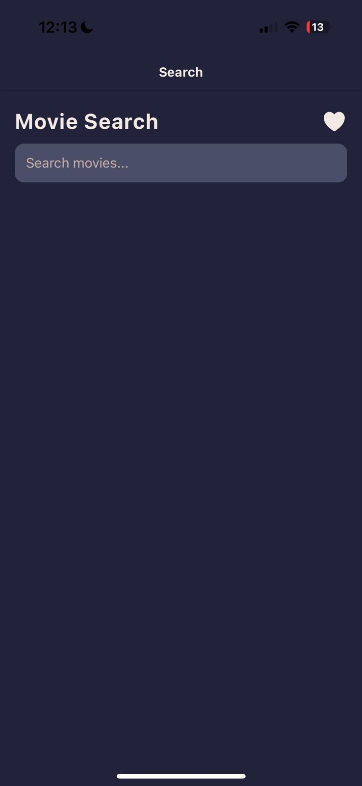
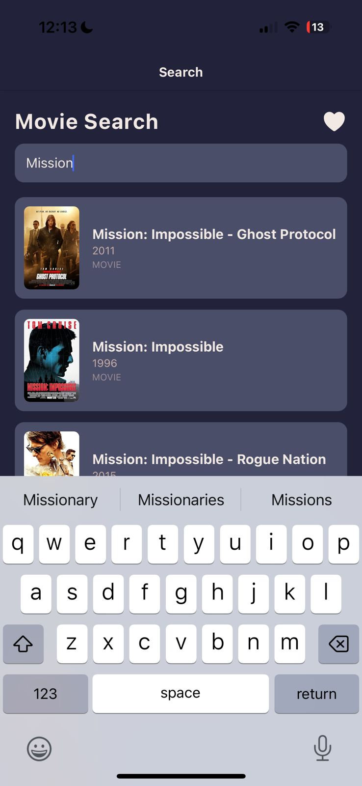
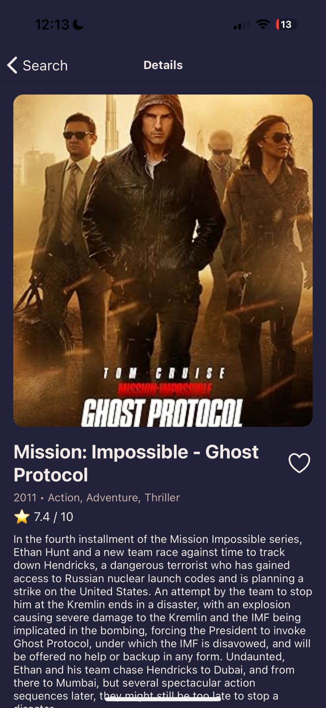
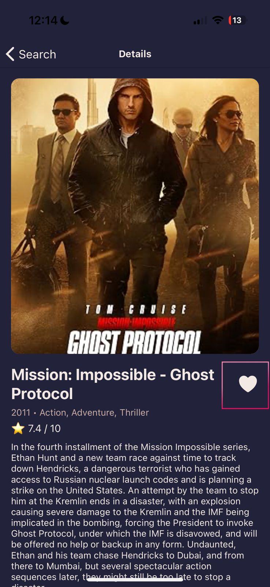
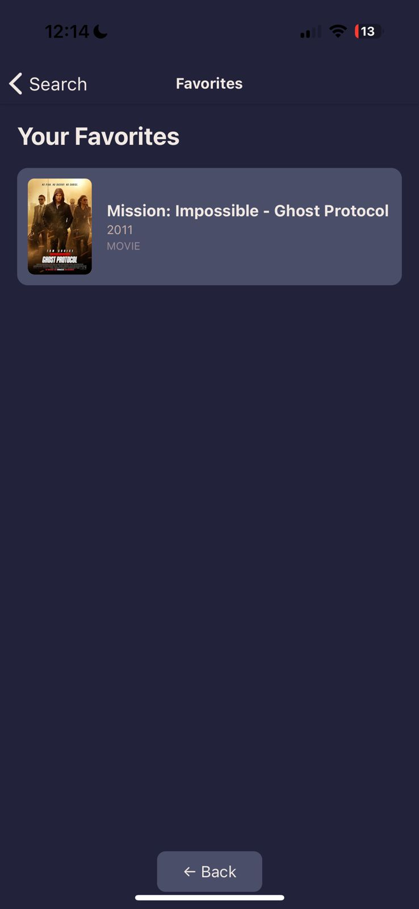
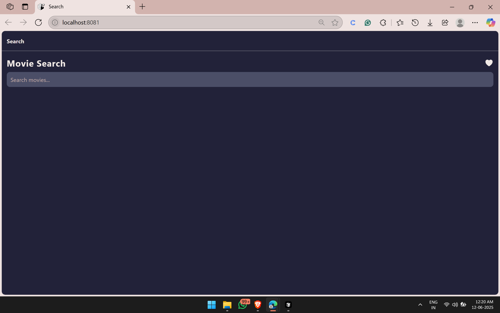
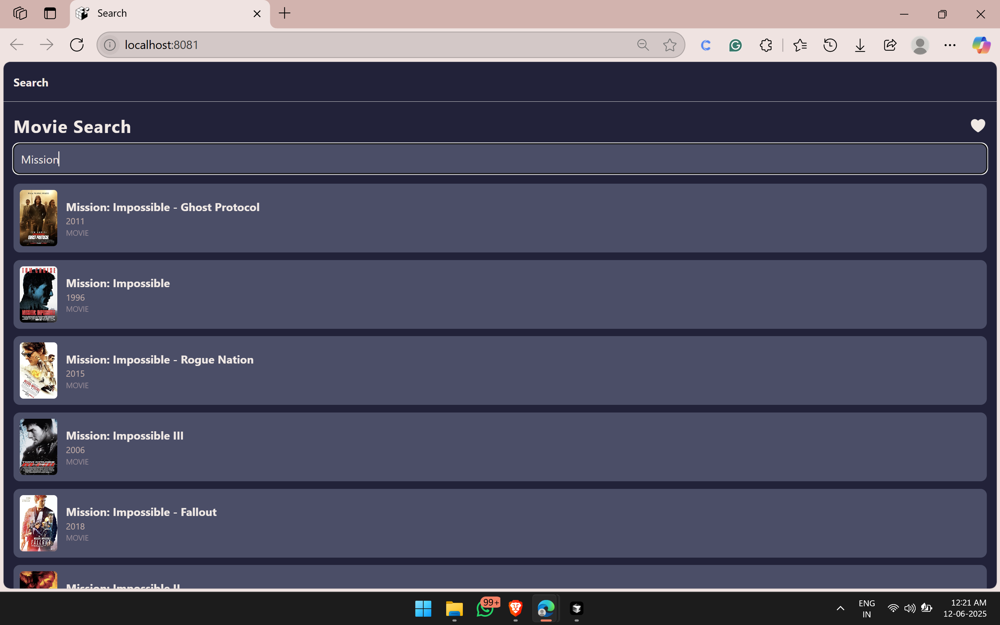
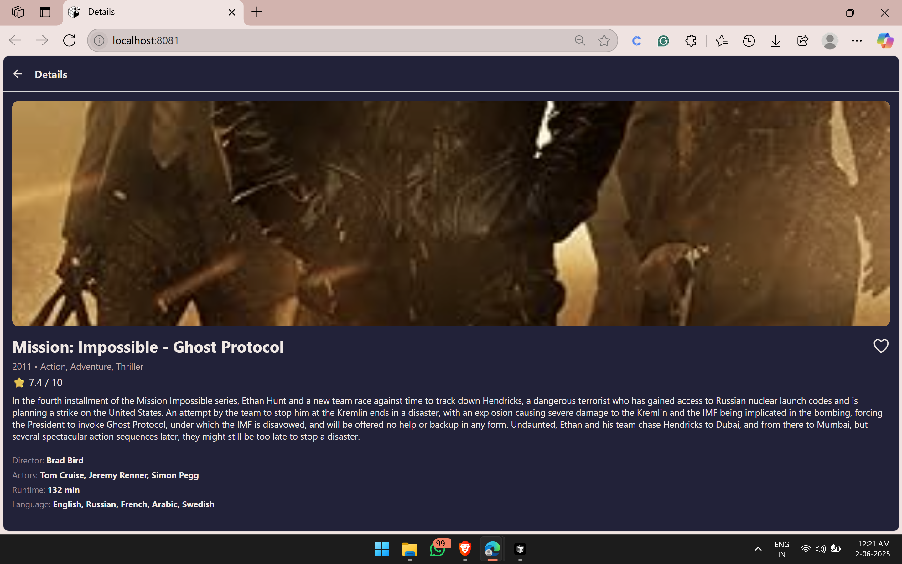
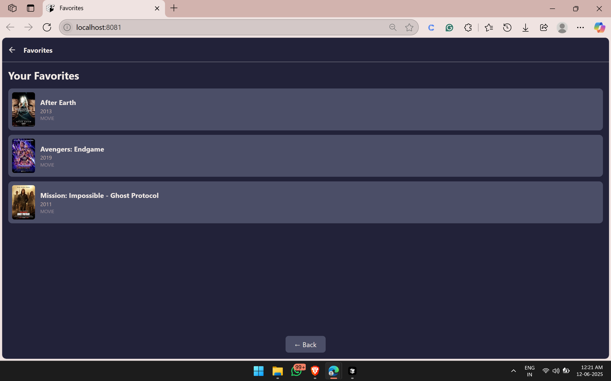

# 🎥✨ Movie Hunt

A sleek **React Native mobile app** to discover movies, explore details, and curate your personal favorites. Built using **Expo** and powered by the **OMDb API**.

---

## 📸 Preview

IOS Device-

<p align="center">
  
  
  
  
  
</p>

Web On Wndows

<p align="center">
  
  
  
  
  
  
  </p>


---

## ✨ Features

* 🔍 **Search movies** by title via the OMDb API
* 🎬 **View rich movie details** — poster, title, year, genre, IMDb rating, plot summary, and more
* ❤️ **Add & remove favorites** with local storage using AsyncStorage
* 🔄 **Infinite scrolling** for seamless result browsing
* 🌙 **Modern dark-themed UI** for a premium experience
* 📱 **Runs on Android, iOS, and optionally Web**

---

## 🚀 Getting Started

### 📥 Clone the Repository

```bash
git clone https://github.com/yourusername/MovieApp.git
cd MovieApp
```

---

### 📦 Install Dependencies

Ensure you have [Node.js](https://nodejs.org/) and [Expo CLI](https://docs.expo.dev/get-started/installation/) installed.

```bash
npm install
```

> 📝 Use `expo install <package>` for any new Expo-managed dependencies.

---

### 🔐 Set Your OMDb API Key

The default API key is:

```javascript
API_KEY = '1014e10e'
```

To use your own key, update the `API_KEY` variable in:

* `screens/SearchScreen.js`
* `screens/DetailsScreen.js`

---

## 🗂️ Project Structure

```
MovieApp/
├── components/
│   └── MovieItem.js
├── screens/
│   ├── SearchScreen.js
│   ├── DetailsScreen.js
│   └── FavoritesScreen.js
├── App.js
├── package.json
└── README.md
```

---

## 📱 Running the App

### Start the Expo development server:

```bash
npx expo start
```

* 📱 **On your phone:**

  * Install **Expo Go** from the App Store (iOS) or Google Play (Android).
  * Scan the QR code from your terminal or browser.

* 🖥️ **On an emulator:**

  * Press `a` for Android or `i` for iOS after starting the server.

* 🌐 **On the Web (optional):**

  * Press `w` in the terminal.

---

## 🛠️ Troubleshooting & Tips

* ⚠️ Use `npx expo start` (not `expo start`) due to CLI updates.
* 🩺 Run `npx expo-doctor` for diagnosing dependency issues.
* 📡 Ensure your computer and mobile device are on the same Wi-Fi for QR scanning.
* 🌐 For web support, install necessary packages:

  ```bash
  npx expo install react-dom react-native-web @expo/metro-runtime
  ```

---

## 📌 Future Enhancements (Optional Ideas)

* 🎞️ Trending and top-rated movie lists
* 🎙️ Search by actor or director
* 🎨 Light/dark theme toggle
* 🌍 Multi-language support
* 📡 Offline favorites caching

---

## 🙌 Made with ❤️ by **Vidhi Jaju**

> *Happy Coding & Movie Exploring! 🎥✨*

